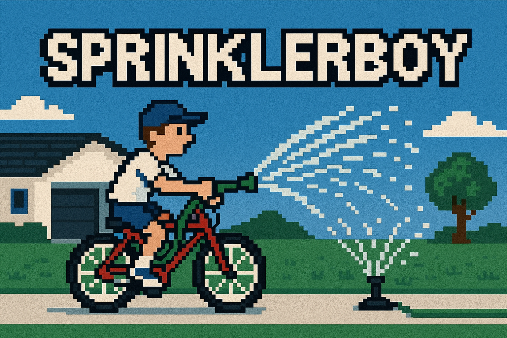
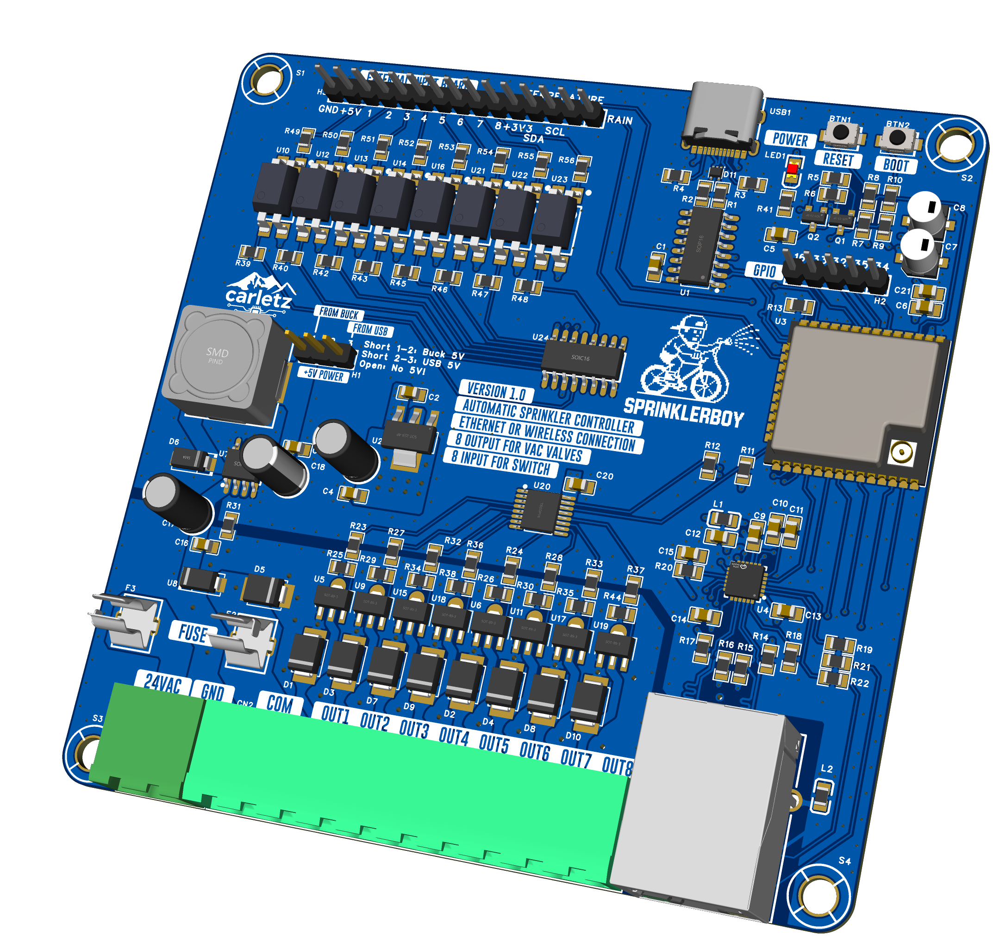

# 🌿 SprinklerBoy – Take Full Control of Your Garden, the Smart Way

**SprinklerBoy** is your next-generation smart irrigation controller built around the powerful ESP32 and equipped with native Ethernet connectivity. Whether you're automating a home garden, greenhouse, or a professional irrigation system, SprinklerBoy delivers robust performance, high expandability, and complete control — right out of the box.

---

## 💡 Key Features

SprinklerBoy is a fully integrated, smart irrigation control system based on the **ESP32-WROOM-32UE** with native Ethernet **LAN8720A** support. Designed for reliable, flexible, and efficient irrigation, the project supports:

- Up to **8 AC-controlled sprinkler valves**
- Multiple **digital and analog inputs**
- **I2C-based expansion**
- **Robust surge protection**

### Main Hardware Features

- **ESP32 MCU**: Wi-Fi + Ethernet (LAN8720A PHY) with external antenna support  
- **8 Triac Outputs**: Control up to 8 AC sprinkler valves via opto-isolated TRIACs (MAC97A8)  
- **Input Protection**:  
  - Surge protection (SMBJ43CA)  
  - Flyback diodes (SS34)  
  - Fuses on both logic and power lines  
- **Multi-Input Capability**:  
  - 1 dry-contact input (e.g., rain sensor, external switches)  
  - 8 local physical push buttons  
  - 1 I2C analog keypad input (via ADS1115)  
  - I2C temperature and rain sensors  

### Communication Interfaces

- **Ethernet (LAN8720A)** with RJ45 magjack and status LEDs  
- **USB Type-C + CH340C** for programming and serial debug  
- **I2C bus** for additional peripherals and sensors  

### Power Supply

- Single **5V DC input** (external or USB-powered)  
- On-board **3.3V and 5V regulators** using LDO and switching converters (BL1117-33, XL1509)

### Modular Design

Four independent schematic blocks:

1. Controller Core (ESP32)  
2. Ethernet Interface  
3. Valve Output & Power Supply  
4. Input Interface Board  

> 🛠️ PCB ready: Designed in **EasyEDA** and optimized for **JLCPCB** assembly

---

## 🔧 Applications

- Home garden irrigation automation  
- Greenhouse or agricultural control systems  
- Integration with home automation platforms (via MQTT, HTTP, Modbus, etc.)

---

## ⚙️ Firmware Features – `sprinklerboy.yaml`

This **ESPHome-based** YAML configuration powers the SprinklerBoy smart irrigation controller, offering full integration with sensors, display, and networking.  
> It has to be adapted to your needs.

---

## 🔌 Connectivity & Core

- ESP32 platform with:
  - Native Ethernet via `esp32_ethernet` using LAN8720  
  - Optional fallback Wi-Fi configuration  
- **MQTT Client**:
  - Publishes and subscribes to irrigation status, commands, schedules, and system variables  
  - Allows full control from platforms like **Home Assistant**, **OpenHAB**, or **Node-RED**

---

## 🌱 Irrigation Control

- **8 irrigation valves** controlled via GPIOs (mapped to hardware TRIACs)  
- **Automatic sequential irrigation**:
  - Configurable runtime per valve  
  - Optional skipping of disabled valves  
  - 5-second pause between valve changes  
- **Manual mode** via MQTT or physical button  
- **Weekly scheduler**:
  - Enable/disable irrigation per day (Mon–Sun)  
  - Each day configurable independently  

---

## 📟 User Interface

- **OLED Display** (SSD1306 128x64):
  - Real-time status updates (active valve, countdown, errors)  
  - Menu navigation using 3 physical buttons (UP, DOWN, OK)  
  - Inactivity timeout returns to standby screen showing:
    - Current time/date  
    - Connection status (ETH or fallback)  
    - Valve enable status summary  

### Menu System:

- Valve status toggle  
- Daily scheduling per valve  
- Irrigation enable/disable  
- Display mode toggle (active screen or standby)

---

## 🌧️ Sensor Inputs

- **Rain sensor** (digital, GPIO16):  
  When rain is detected, automatic irrigation is inhibited  

- **External temperature sensor** (via MQTT or physical):  
  Reserved for potential future logic (e.g., frost prevention)

---

## 🔘 Inputs

- 3 analog buttons via **ADS1115** (menu navigation)  
- 8 digital dry-contact inputs (opto-isolated):  
  - Usable for triggers, overrides, manual start, etc.

---

## 📤 MQTT Topics Overview

Includes topics for:

- Starting/stopping irrigation  
- Enabling/disabling individual valves  
- Scheduling per day  
- Reading back system status:
  - Active valve  
  - Remaining time  
  - Rain detection  
  - Connection status  
  - Errors  

---

## 🛡️ Safety & Logic

- Prevents irrigation when rain is detected  
- Watchdog logic to ensure no valve stays stuck  
- Auto-reset irrigation cycle in case of error  

---

## ⚠️ Disclaimer

> This project is provided for **educational purposes only**.

The author(s) of this repository **do not take any responsibility** for:

- Incorrect use of the design or schematics  
- Damage to equipment, persons, or property  
- Installation in unsafe or non-compliant environments  

Any implementation of this project in real-world systems should be done under the responsibility of a **qualified professional**, and in compliance with local regulations and safety standards.

By using this material, you acknowledge that it is offered **as-is**, **without warranty of any kind**, and you agree to use it **at your own risk**.

---
